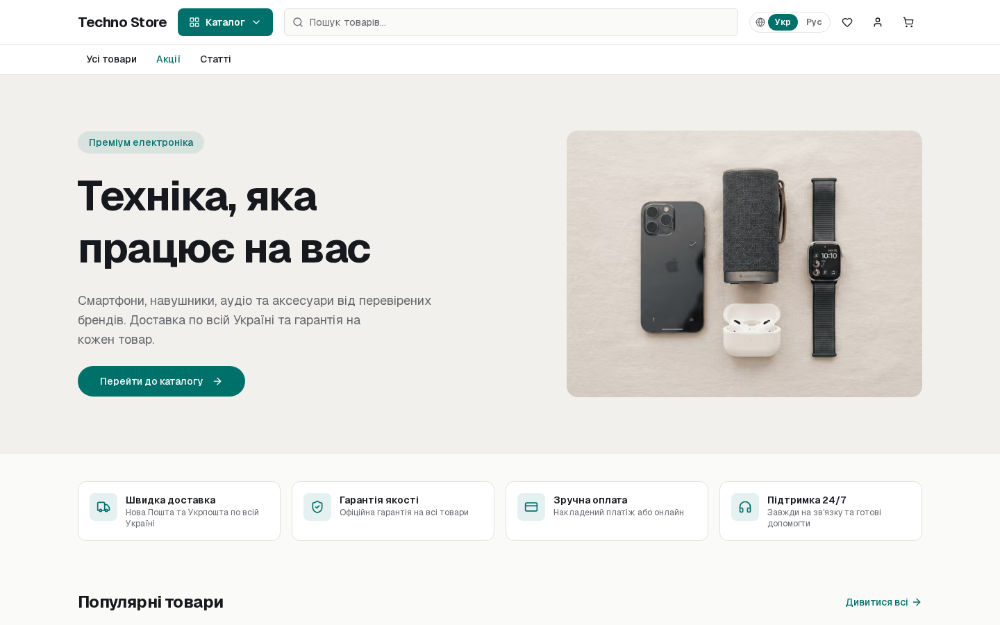
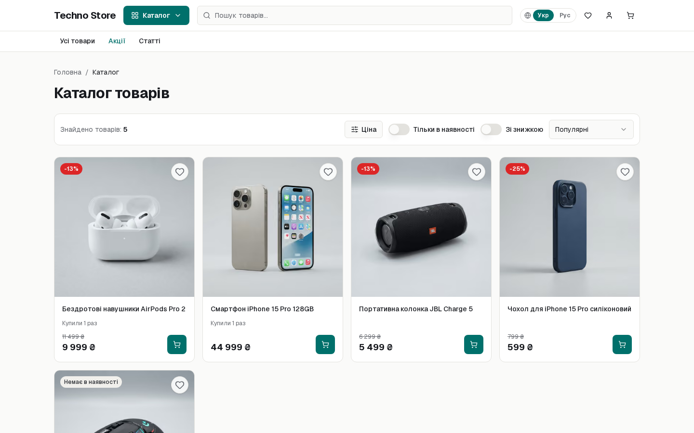
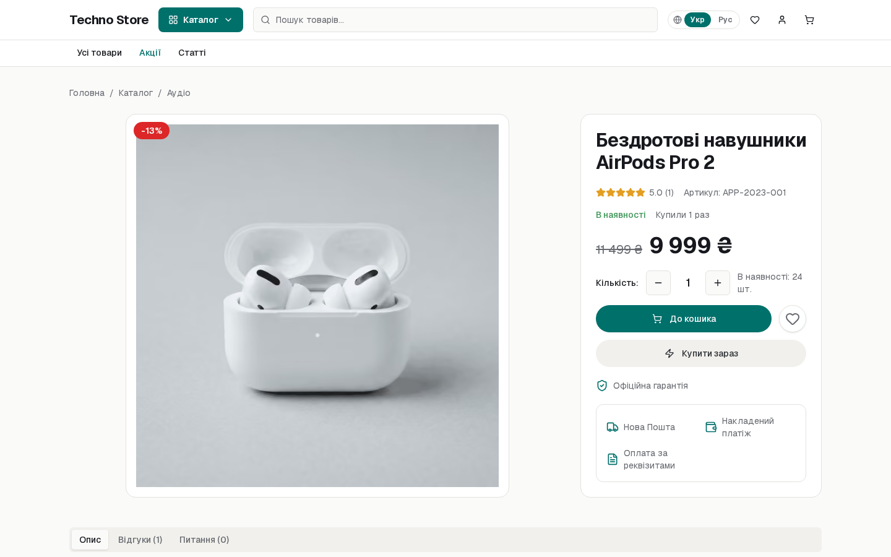

# Universal CRM UA

[](https://github.com/vasdko4/universal-crm-ua/releases/latest)
[](LICENSE)
[](https://github.com/vasdko4/universal-crm-ua/pkgs/container/universal-crm-ua)

Самохостинг-движок интернет-магазина + CRM для украинского рынка.
Каталог, заказы, клиенты, Новая Почта, Monobank / WayForPay — на вашей машине,
без SaaS и без обязательного облака.

**Version 2.0.0** · self-hosted Ukrainian e-commerce + CRM (storefront, admin, Nova Poshta, Monobank / WayForPay, Docker).

**Демо:** https://magazine-test-ten.vercel.app
**Релиз:** https://github.com/vasdko4/universal-crm-ua/releases/tag/v2.0.0
**Образ:** `ghcr.io/vasdko4/universal-crm-ua:2.0.0`

```bash
curl -fsSL https://raw.githubusercontent.com/vasdko4/universal-crm-ua/main/install.sh | bash
```

<p>
  
  
  
</p>

---

## Что это

Один процесс Next.js отдаёт витрину и админку. Данные — PostgreSQL на том же сервере.
Фото товаров — локальный том (или Vercel Blob, если деплой на Vercel).

Подходит любой нише: техника, одежда, косметика, автотовары. Название, дизайн,
категории и контент задаются в `/admin`, не в коде.

| | |
|---|---|
| Витрина | `/` украинский, `/ru` русский |
| Админка | `/admin` |
| Мастер первой установки | `/setup` (после завершения закрывается) |
| Health | `GET /api/health` → `{ status, db }` |

---

## Требования

| | Минимум | Рекомендуется |
|---|---|---|
| ОС | Ubuntu 22.04 / 24.04 | 24.04 |
| RAM | 2 ГБ (+ swap, инсталятор поставит сам) | 4 ГБ |
| Диск | 10 ГБ | 20 ГБ |
| Доступ | root или sudo | |
| Домен | не обязателен (`http://IP:3000`) | A-запись на IP, порты 80 и 443 |

Другие ОС: поставьте Docker сами, затем тот же `install.sh`.

---

## Установка на чистый VPS

Одна команда. Исходники и Node.js на хосте не нужны — ставится готовый образ из GHCR.

```bash
curl -fsSL https://raw.githubusercontent.com/vasdko4/universal-crm-ua/main/install.sh | bash
```

Скрипт:

1. Ставит пакеты, часовой пояс `Europe/Kyiv`, swap 2 ГБ (если RAM < 4 ГБ), UFW.
2. Ставит Docker + Compose, если их нет (без вопроса Y/n — иначе `curl | bash` зависает).
3. Спрашивает домен. Enter — магазин на `http://IP:3000`.
4. Пишет `~/magazine/.env` (секреты auth, пароль БД, FTP).
5. Тянет `ghcr.io/vasdko4/universal-crm-ua:latest`, поднимает Postgres + приложение.
6. Если домен указан — поднимает Caddy и выпускает Let's Encrypt (nginx/certbot не нужны).

Неинтерактивно:

```bash
DOMAIN=shop.example.com bash install.sh
```

Другая версия образа:

```bash
IMAGE=ghcr.io/vasdko4/universal-crm-ua:2.0.0 bash install.sh
```

Пропустить подготовку ОС (Docker уже стоит):

```bash
SKIP_VM_SETUP=1 bash install.sh
```

### После запуска

Откройте адрес, который вывел скрипт. Откроется мастер:

- чистая CRM или демо-каталог;
- название и описание магазина;
- ключ Новой Почты (можно позже);
- логин и пароль администратора.

Мастер одноразовый. Дальше — `/admin`.

Демо-данные **до** первого захода в мастер (иначе мастер уже создаст магазин):

```bash
cd ~/magazine && docker compose exec app node scripts/db-setup.mjs --seed
```

Демо-админ: `admin@magazine.store` / `Admin12345` — смените пароль сразу.

### Домен и HTTPS

Нужно от вас:

- A-запись домена → IP сервера;
- порты **80** и **443** открыты;
- для FTP снаружи — ещё **21** и **21000–21010**.

Добавить домен к уже стоящему магазину: пропишите в `~/magazine/.env`

```
DOMAIN=shop.example.com
BETTER_AUTH_URL=https://shop.example.com
NEXT_PUBLIC_SITE_URL=https://shop.example.com
```

и перезапустите с профилем прокси:

```bash
cd ~/magazine
COMPOSE_PROFILES=ftp,proxy docker compose up -d
```

### Обновление

```bash
cd ~/magazine && docker compose pull && docker compose up -d
```

База, загрузки и сертификаты в Docker-томах — не сносятся. Схема на старте контейнера
дотягивается через `db/migrate.sql` (идемпотентно).

Из админки: **Настройки → Обновления** (нужен сайдкар `updater` — `install.sh` его поднимает).

---

## Другие способы поставить

### Из исходников, тоже Docker

Когда нужен билд с этой машины, а не готовый образ:

```bash
git clone https://github.com/vasdko4/universal-crm-ua.git
cd universal-crm-ua
chmod +x start.sh
./start.sh
```

`start.sh` готовит ВМ, пишет `.env`, собирает `docker compose up -d --build`.

### Без Docker, systemd + nginx

С корня репозитория на Ubuntu:

```bash
sudo DOMAIN=shop.example.com bash scripts/vps-install.sh
```

Ставит Node 22, pnpm, PostgreSQL, nginx, systemd-сервис `magazine`, ежедневный бэкап БД.
HTTPS: `certbot --nginx -d shop.example.com`.

### Локальная разработка

Нужны Node.js 20+, pnpm, Docker (только для Postgres).

```bash
pnpm setup          # .env.local, зависимости, Postgres, пустая схема
pnpm dev            # http://localhost:3000 — мастер установки
pnpm setup --seed   # то же + демо-каталог (admin@magazine.store / Admin12345)
pnpm test
```

Подробности: [README.local.md](README.local.md). Переменные: [.env.example](.env.example).

---

## Движок

### Витрина

- Каталог, категории, группы, фильтры, поиск, карточка товара, варианты
- Корзина, оформление, личный кабинет, адреса, избранное, промокоды
- Отзывы и вопросы по товару
- Статьи и произвольные страницы (`/p/...`)
- UA / RU: отдельные поля `*_uk` / `*_ru`, URL `/ru/...`
- SEO: sitemap, robots, canonical, Open Graph, фид Google Merchant (`/feed/google-merchant.xml`)

### CRM (`/admin`)

| Раздел | Зачем |
|---|---|
| Заказы | статусы, история, новое заказ из админки, брошенные корзины |
| Товары | карточки UA/RU, фото, варианты, импорт, корзина удалённых |
| Категории / группы | дерево каталога |
| Клиенты | карточки, заказы клиента |
| Пользователи | роли и права на разделы админки |
| Доставка | Новая Почта: отделения, трекинг, cron-синхронизация статусов |
| Оплата | Monobank, WayForPay — ключи в настройках |
| Акции | скидки, промокоды |
| Контент | статьи, страницы, модальные баннеры, главная |
| Статистика | продажи, бестселлеры |
| Журнал | действия администраторов |
| Обновления | текущая / последняя версия, кнопка обновить образ |

Интеграции, которые включаются ключами, а не отдельным хостингом: SMTP, Telegram-бот,
Google Ads / Analytics, ключ Новой Почты.

### Стек 2.0

| Слой | |
|---|---|
| Приложение | Next.js 16 (App Router), React 19, TypeScript |
| Данные | PostgreSQL 16, Drizzle ORM, схема в `db/schema.sql` |
| Миграции | `db/migrate.sql` + `migrations/*.sql` (`IF NOT EXISTS`, без ORM-мигратора) |
| Auth | Better Auth (админка и кабинет покупателя) |
| UI | Tailwind CSS 4, Radix UI |
| Картинки | sharp; self-host — `public/uploads`, Vercel — Blob |
| Прод | Docker Compose, Caddy (авто-HTTPS) или nginx |
| Релизы | тег `v*`, образ в GHCR, опционально Docker Hub |

Схема меняется SQL-файлами, не `drizzle-kit`. Новая колонка — сразу в `schema.sql`,
`migrate.sql` и `migrations/00N_*.sql`.

---

## Эксплуатация

Файлы установки: `~/magazine` (`.env` не удалять).

| Данные | Том |
|---|---|
| PostgreSQL | `magazine_pgdata` |
| Фото / загрузки | `magazine_uploads` (есть FTP) |
| Сертификаты Caddy | `magazine_caddy_data` |

Команды из `~/magazine`:

```bash
docker compose logs -f app
docker compose restart app
docker compose down
docker compose exec db pg_dump -U magazine magazine > backup.sql
```

Healthcheck контейнера бьёт в `/api/health` (приложение + БД).

Cron доставки: `GET /api/cron/delivery-sync` с `Authorization: Bearer $CRON_SECRET`.
Без секрета эндпоинт открыт — не оставляйте так в проде.

---

## Документация

- [README.docker.md](README.docker.md) — Compose из исходников, Makefile, FTP, SEO/Ads, env, поломки
- [README.local.md](README.local.md) — разработка без полного Docker-стека
- [db/README.md](db/README.md) — схема и миграции

Релиз образа: `git tag vX.Y.Z && git push origin vX.Y.Z` (workflow `.github/workflows/release.yml`).
GitHub App теги не создаёт — для CI без тега достаточно ветки `v2.0.0`.
